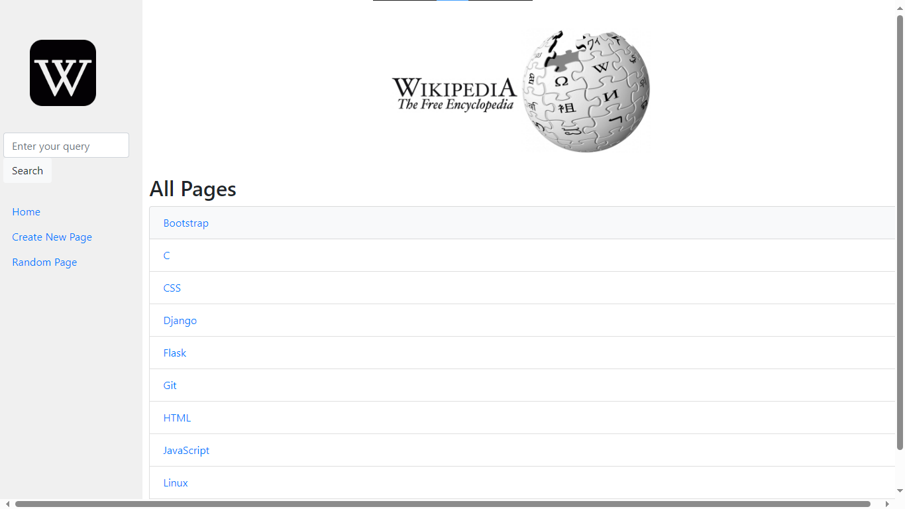

# CS50's Web Programming with Python and Javascript

CS50W delves deep into the design and implementation of web applications using **Python**, **JavaScript** and **SQL**. The course covers various topics such as *Database Design, Scalability, Security, User Experience*, *Testing* etc. The major tools used in the course are **Django**, **React** (Introduction), **Bootstrap**, **Github** (Version Control and Collaboration) etc.

## Projects

### 0. [Search](search/) - Google Clone 

### 1. [Wiki](https://github.com/akshay-rajan/wiki) - Blogging Website

### 2. [Commerce](https://github.com/akshay-rajan/commerce) - Auctions App

### 3. [Mail](mail/) - E-mail Application Frontend using JavaScript

### 4. [Network](https://github.com/akshay-rajan/network) - A Social Media App

### 5. [Final Project](https://github.com/akshay-rajan/devicedash) - DeviceDash

